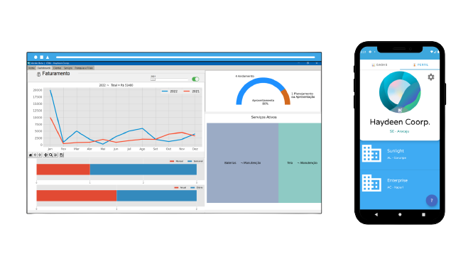
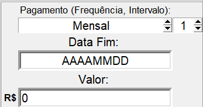

<h1 align="center"> Haydeen CRM<h1>

    

<a href="mailto:gustavofernandeslobo@gmail.com" >
</img>
</a><a href="https://gflobo.github.io/haydeen-crm/" rel="some text" >
</img>
</a><a href="https://github.com/gfLobo/haydeen-crm/wiki/Sobre"  >
</img></a>

  

### Informações gerais
Você pode adquirir uma cotação personalizada deste CRM entrando em contato através deste perfil ou pelo e-mail abaixo.

 
 
 

## Instruções iniciais
* Abra o agendador de tarefas e programe o arquivo **email2.exe** para ser executado sempre ao ligar o computador. Segue um tutorial de como realizar essa operação  ⤵
     
     
     

    
<h4 align="center">Como utilizar o agendador de Tarefas do Windows:</h4>

<h6 align="center">Clique na imagem e veja o Tutorial</h6>

 

* Os campos de de pagamento devem respeitar o formato pelo qual foram desenvolvidos.

    ⚠ *Uma atenção especial ao campo "Data Fim", este não deve conter em nenhuma hipótese divisões com /, -, ou qualquer tipo de simbolo.*
    
     

    
    
     

    
    ✅ **Formato permitido:** 20281212

    🚫 **Formatos ***não*** permitidos:** 2028/12/12  **;**  2028-12-12
